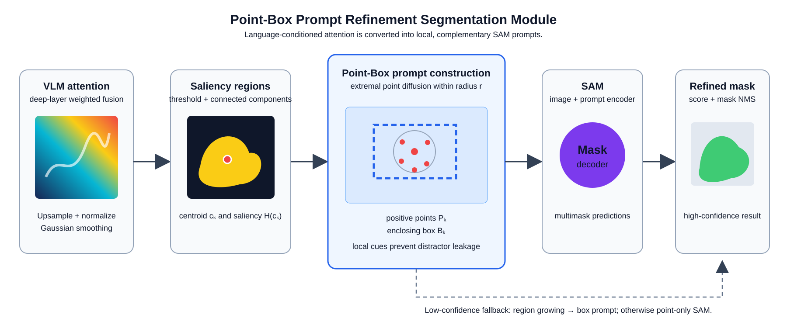

# ZeroRS

Training-free **Zero-Shot Remote Sensing Referring Segmentation**. ZeroRS preserves the original three-foundation-model design while replacing duplicated scripts with a clear late-fusion pipeline:

1. **VLM attention** supplies language-conditioned spatial evidence.
2. **ODISE / diffusion** and VLM-guided SAM independently produce candidate masks.
3. **Point-Box Prompt Refinement** converts deep VLM attention into local point and box prompts for SAM.
4. **Late candidate verification** scores masks against attention; a region-grow / point fallback is used only when confidence is inadequate.

This avoids early pixel-wise VLM-DM fusion and its error propagation, while retaining the original Qwen, ODISE, and SAM framework.

## Repository layout

```text
zerors/
  attention.py           # heatmap preparation, salient regions, region growing
  point_box_refiner.py   # Point-Box Prompt Refinement Segmentation Module
  selection.py           # late mask verification
  pipeline.py            # hybrid prediction plus confidence fallback
  config.py              # reproducible experiment settings
tests/                   # CPU-only unit tests for the new module
assets/                  # paper-ready module figure (SVG and PNG)
```

The original numbered scripts are retained as an archival reference. New work should import the package instead of copying their functions.

`run_zerors.py` is the new entry point. It runs the VLM-SAM branch by itself when ODISE arguments are omitted, or late-fuses the ODISE branch when both ODISE paths are given. The importable `odise_refiner.py` compatibility shim retains the legacy helper without duplicating it.

## Installation

```bash
conda create -n zerors python=3.10 -y
conda activate zerors
pip install -r requirements.txt
```

Install the CUDA-compatible builds of [Segment Anything](https://github.com/facebookresearch/segment-anything), [ODISE](https://github.com/NVlabs/ODISE), Detectron2, and `qwen-vl-utils` separately. Keep model checkpoints outside this repository and set their paths in `ZeroRSConfig`.

## Point-Box Prompt Refinement

For weighted deep-layer VLM attention \(A\), the module upsamples and smooths it to \(H\), extracts connected saliency regions, then converts each region into a local set of positive points and an enclosing box:

\[
H=\mathcal{G}_{\sigma}\left(\operatorname{Norm}(\operatorname{Upsample}(A))\right),\quad
P_k=\{(x,y): \|(x,y)-c_k\|_2\le r,\;H(x,y)\ge\tfrac{1}{2}\max H\},
\]

\[
B_k=[\min_{P_k}x,\min_{P_k}y,\max_{P_k}x,\max_{P_k}y].
\]

SAM receives `(positive points, box)` jointly, returns multimask proposals, and NMS removes duplicates. The first fallback grows a region from salient centroids and uses its box; the second falls back to point-only SAM.



The figure is an editable, lossless SVG: [assets/point_box_prompt_refinement.svg](assets/point_box_prompt_refinement.svg).

## Minimal integration

```python
from zerors import PointBoxPromptRefiner, ZeroRSConfig, ZeroRSPipeline

# `attention_provider(image, query)` returns a 2-D VLM attention map.
# `diffusion_provider(image, query)` returns list[MaskCandidate] from ODISE.
refiner = PointBoxPromptRefiner(sam_predictor)
pipeline = ZeroRSPipeline(attention_provider, diffusion_provider, refiner, config)
prediction = pipeline.predict(image, "the tennis court on the right")
```

## Verification

The package-level point-box logic is dependency-light and can be tested without checkpoints:

```bash
python -m unittest discover -s tests -v
python -m py_compile zerors/*.py
```

Full inference still requires locally available Qwen2.5-VL, SAM, ODISE, compatible CUDA, and the RRSIS-D/RISBench data.
