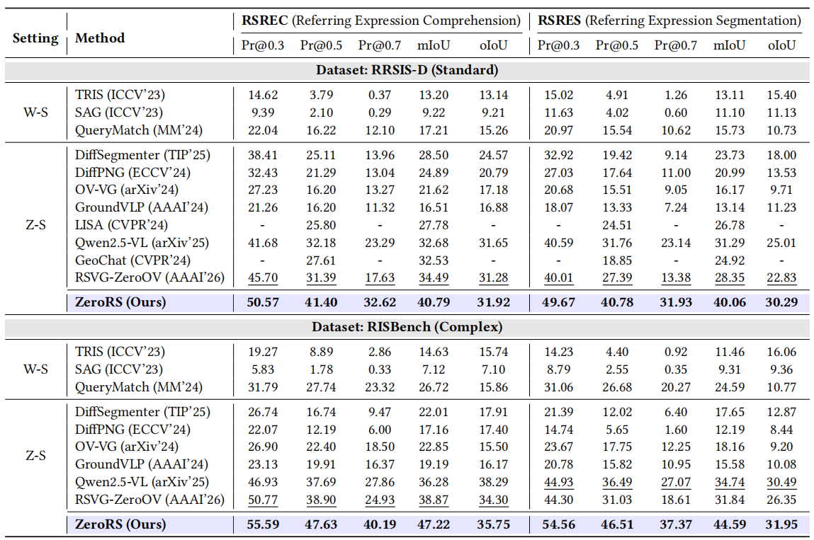

# ZeroRS

Zero-shot remote sensing referring segmentation with Qwen2.5-VL, ODISE, and SAM.

## Results



## Files

```text
zerors/
run_zerors.py
odise_refiner.py
tests/
```

## Setup

```bash
conda create -n zerors python=3.10 -y
conda activate zerors
pip install -r requirements.txt
```

Install CUDA-compatible Segment Anything, ODISE, Detectron2, and `qwen-vl-utils` separately.

## Run

```bash
python run_zerors.py \
  --dataset-json /data/rrsisd.json \
  --image-dir /data/images \
  --qwen-model /models/Qwen2.5-VL-7B-Instruct \
  --sam-checkpoint /models/sam_vit_h_4b8939.pth \
  --odise-config /models/odise_label_coco_50e.py \
  --odise-weights /models/odise_label_coco_50e-b67d2efc.pth
```

Omit the two ODISE arguments to run only the Qwen-SAM branch.

## Check

```bash
python -m unittest discover -s tests -v
python -m py_compile zerors/*.py run_zerors.py odise_refiner.py
```
